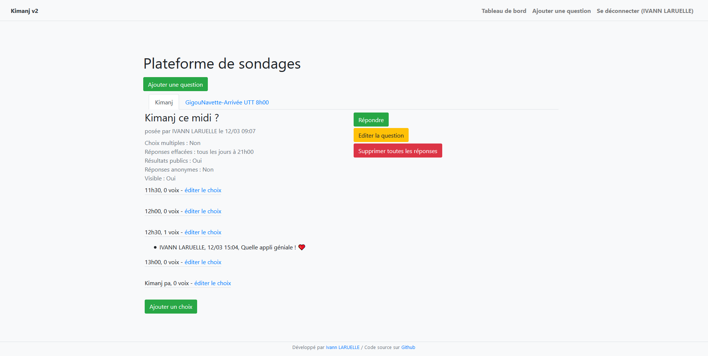
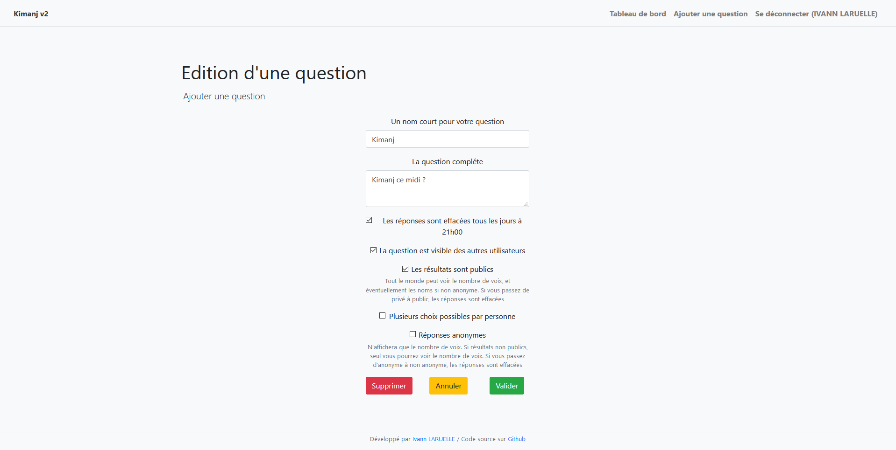
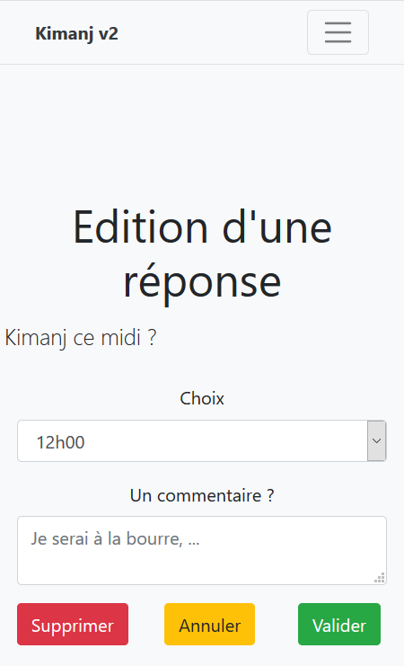

# Kimanj

## But
Kimanj est une application de sondage ayant pour but de désengorger les conversations Messenger entre amis.

## Fonctionnalités (v2) :
* Connexion via le [site etu](https://etu.utt.fr/api/panel) de l'[Université de Technologie de Troyes](https://www.utt.fr)
* Réinitialisation des réponses sur certaines questions via cron
* Réponses anonymes ou non (affichage des noms des personnes qui ont répondu ou seulement du nombre de réponses pour chaque option)
* Résultats publics ou non (affichage des résultats, éventuellement anonymes, pour tous ou seulement l'auteur)
* Affichage ou non de la question
* Affichage compatible smartphone / tablettes
* Affichage ergonomique des questions sur une seule page
* Développé avec PHP 7.4 / Symfony 5.1 / Doctrine 2.7 / Twig 3 + Bootstrap 4.1

## Captures d'écran
### Page d'accueil

### Edition d'une question

### Répondre sur mobile


Plus de documentation dans le dossier docs
## Installation
### 0) Prérequis
* Php 7.4
* MariaDB / MySQL 5.7
* composer
### 1) Récupérez le repos et installez les dépendances
```
sudo -u www-data git clone https://github.com/larueli/kimanj.git
sudo -u www-data cd kimanj && composer install
sudo -u www-data cp kimanj/.env kimanj/.env.local
```
### 2) Configurez le projet et la BDD
Editez ensuite le ``.env.local`` à votre guise, notamment pour la [BDD](https://symfony.com/doc/4.4/doctrine.html#configuring-the-database)
### 3) Migrez la BDD
```
# Si besoin de créer la BDD
# sudo -u www-data php bin/console doctrine:database:create
sudo -u www-data php bin/console make:migration
sudo -u www-data php bin/console doctrine:migrations:migrate
```
* Configurez ensuite nginx comme indiqué [ici](https://symfony.com/doc/4.4/deployment.html).
* Ajoutez cette ligne dans votre cron : ``mn hour * * * sudo -u www-data php /var/www/kimanj/bin/console app:cleanup`` pour l'effacement automatique, et mettez la valeur ``HEURE_RAZ={hour}h{mn}`` dans le env.

# Remettre à zéro la BDD

## Première méthode (sans drop de la DB)
```
# Stopper le serveur web / bloquer l'accès puis

sudo -u www-data php bin/console doctrine:schema:drop --full-database --force

# Effacer les dossiers src/Migrations et Images puis

sudo -u www-data php bin/console make:migration
sudo -u www-data php bin/console doctrine:migrations:migrate
```
## Deuxième méthode (avec drop de la DB)
```
# Stopper le serveur web / bloquer l'accès puis
# DROP DB;
# Effacer les dossiers src/Migrations et Images puis

sudo -u www-data php bin/console doctrine:database:create
sudo -u www-data php bin/console make:migration
sudo -u www-data php bin/console doctrine:migrations:migrate
```

# Auteur

Je suis [Ivann LARUELLE](https://www.linkedin.com/in/ilaruelle/), étudiant-ingénieur en Réseaux et Télécommunications à l'[Université de Technologie de Troyes](https://www.utt.fr/), école publique d'ingénieurs.

N'hésitez pas à me contacter pour me signaler tout bug ou remarque. Je suis joignable à [ivann.laruelle@gmail.com](mailto:ivann.laruelle@gmail.com).
